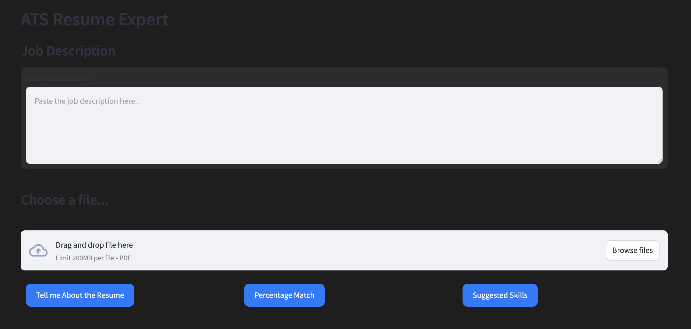

# Resume Data Extractor with Gemini Pro Vision

This Streamlit powered ATS(Applicant Tracking System) leverages the Gemini Pro Vision API to extract data from resume in PDF format and evaluate them based on a given job description. Users can upload a resume, view the resume image, and extract relevant information, check percentage matches, etc.

## Features

- Upload a resume in PDF format.
- Resume Evaluation: Provide detailed professional evaluations and summaries tailored to the job description
- Match Percentage Calculation: Calculates the percentage match of a resume to a job description.
- Skill Recommendations: Generates personalized recommendations for skills and certifications.

## Prerequisites

- Python 3.10
- [Streamlit](https://streamlit.io/)
- [Gemini Pro Vision API Key](https://ai.google.dev/tutorials/python_quickstart)

## Installation

1. **Clone the repository:**
   ```bash
   git clone https://github.com/your-username/your-repo.git
   ```
2. **Navigate to the project directory:**
   ```bash
   cd your-repo
   ```
3. **Install the required Python packages:**
   ```bash
   pip install -r requirements.txt
   ```
4. **Create a .env file in the project root and add your Gemini Pro Vision API key:**
   ```bash
   GOOGLE_API_KEY=your-google-api-key
   ```
5. **Usage**
   Run the Streamlit app with the following command:
   ```bash
   streamlit run app.py
   ```

6. **Application UI**


## License

This project is licensed under the MIT License.
